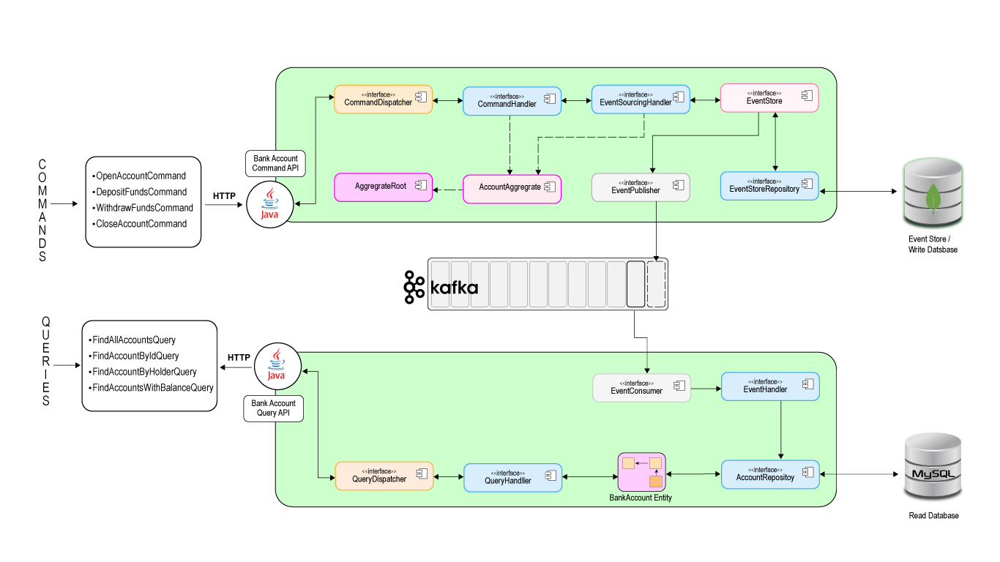

#   Bank Microservices, CQRS, Kafka, Domain Driven Design (DDD)

#####  Bank Microservices created using Java, Domain Driven Design (DDD), CQRS & Event Sourcing. 

- Project's code is structured  using Domain-Driven-Design. 
- Project uses a combination of MySQL and kafka as an event store.
- CQRS & Event Sourcing with Kafka.
- A Bank app to open and close a bank account, add and withraw funds and also query all transactions.
- Built with Spring Boot, Apache Kafka, MySQL, MongoDB.
- 





```